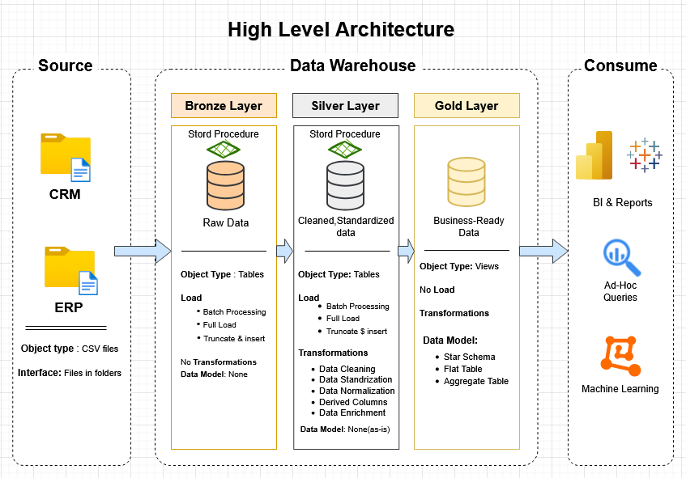

# 🚀 Data Warehouse and Analytics Project

Welcome to the **Data Warehouse and Analytics Project** repository!This repository contains a modern data warehouse implementation using SQL Server. The project follows the Medallion Architecture to process raw data into actionable insights through structured ETL pipelines.

---

## 🏗️ Data Architecture: Medallion Framework

This project implements the **Medallion Architecture**, organizing data into three logical layers to ensure quality and reliability:

1.  **Bronze Layer (Raw):** * Acts as the landing zone.
    * Stores raw data ingested from **CSV files** into the **SQL Server Database** without any modifications.
2.  **Silver Layer (Cleansed):** * Focuses on data cleansing, standardization, and normalization.
    * Handles duplicates, re-formats dates, and prepares data for advanced analysis.
3.  **Gold Layer (Analytical):** * Houses business-ready data.
    * Modeled into a **Star Schema** with optimized Fact and Dimension tables for high-performance reporting.

---

## 📖 Project Overview
This project demonstrates expertise in building a modern data pipeline:

* **Architecture Design:** Implementing a 3-tier warehouse structure.
* **ETL Pipelines:** Automated workflows to extract, transform, and load data seamlessly.
* **Data Modeling:** Developing Fact and Dimension tables for structured analytical queries.
* **Analytics & Reporting:** Generating SQL-based reports and dashboards to provide actionable insights.

---

## 🎯 Skills Showcased
This repository is a resource for those looking to explore my expertise in:
* ✅ SQL Development (T-SQL)
* ✅ Data Architecture
* ✅ Data Engineering (ETL Pipelines)
* ✅ Dimensional Data Modeling
* ✅ Data Analytics & Reporting

---

## 📂 Project Structure
* `📂 bronze/`: Raw data ingestion scripts.
* `📂 silver/`: Cleansing and transformation procedures.
* `📂 gold/`: Fact & Dimension table models.
* `📂 reports/`: Analytical SQL queries and insights.

---

## 🚀 How to Get Started
1. Clone the repository.
2. Run the `bronze` scripts to load initial data.
3. Execute the `silver` stored procedures to clean and standardize the data.
4. Use the `gold` models for final reporting.
